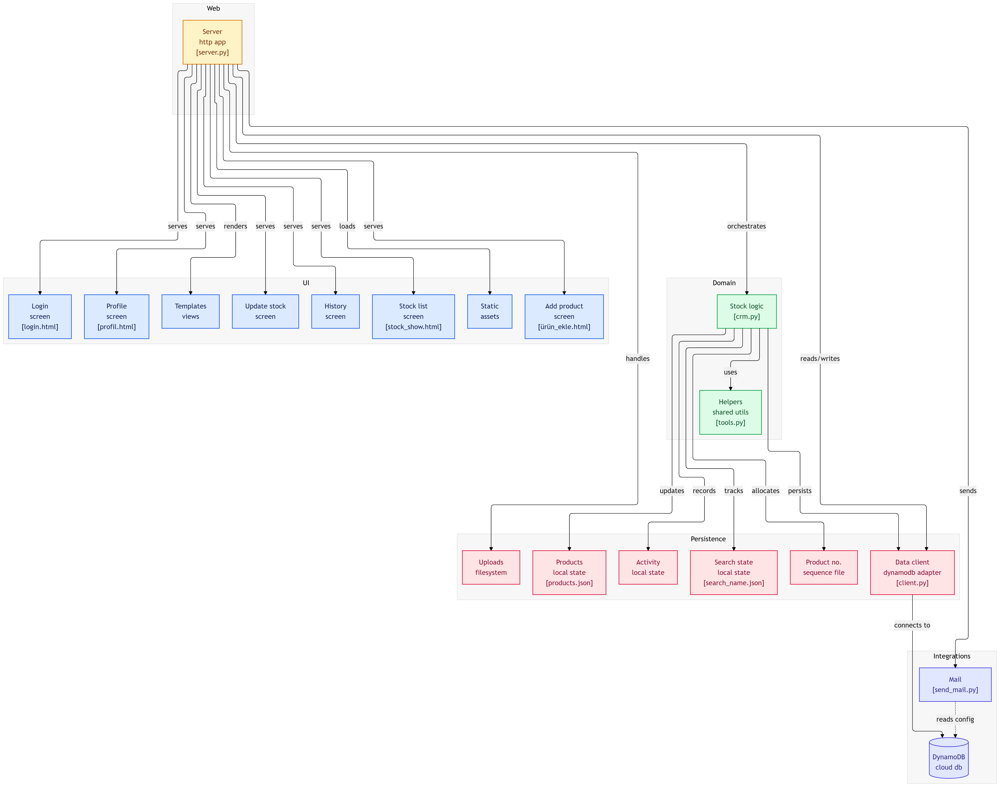

# Stock Tracking Web App (AWS DynamoDB)

Flask-based stock tracking application backed by AWS DynamoDB. It provides inventory management, product recipes, stock logs, and Excel import/export workflows for small operations.

## Features

- User authentication and role-based permissions
- Stock item creation and updates
- Product definitions with material consumption
- Stock logs with filtering
- Recent activity and dashboard metrics
- Excel export/import for stock and logs
- Password reset via email (SMTP config)

## Tech Stack

- Python + Flask
- AWS DynamoDB via boto3
- Pandas + OpenPyXL for Excel I/O
- HTML templates and static assets

## Project Diagram


## Prerequisites

- Python 3.8+
- AWS account with DynamoDB access
- SMTP credentials for password reset emails (optional)

## Setup

1. Create a virtual environment and install dependencies:

   ```bash
   python -m venv .venv
   source .venv/bin/activate
   pip install -r requirements.txt
   ```

2. Create `crm/.secret` with your local configuration:

   ```json
   {
     "url": "http://localhost:5454/?parametre=YOUR_TOKEN",
     "parameter": "YOUR_TOKEN",
     "secret_key": "flask-secret",
     "access_key_id": "AKIA...",
     "secret_access_key": "...",
     "region_name": "eu-central-1",
     "instance_id": "i-1234567890abcdef0"
   }
   ```

   Notes:
   - `parameter` must match the token used in `Tools.auth` (`crm/tools.py`). Update one or the other so they match.
   - `instance_id` is only required for `crm/client.py`.
   - Keep `.secret` private and out of version control.

## DynamoDB Tables

The table names are hard-coded in `crm/tools.py`:

- `kullanicilar` (partition key: `username`)
- `urunler` (partition key: `Urun_Ismi`)
- `stok` (partition key: `Ozel_Kod`)
- `log` (partition key: `Ozel_Kod`, sort key: `Tarih`)
- `inputs` (partition key: `Label_name`)

## Running Locally

```bash
cd crm
python crm.py
```

The app listens on `http://localhost:5454` and opens the `url` configured in `.secret`.

## Optional EC2 Helpers

- `crm/server.py`: starts/stops an EC2 instance and runs the app via SSH (requires `paramiko` and filling in AMI/instance info).
- `crm/client.py`: opens the app using the EC2 public IP from AWS.

Install the optional dependency if you use `server.py`:

```bash
pip install paramiko
```

## Local Data Files

The following files in `crm/` store local state and must be writable:

- `products.json`
- `search_name.json`
- `recent_activity.json`
- `created_product_number`

## License

See [LICENSE](LICENSE).
